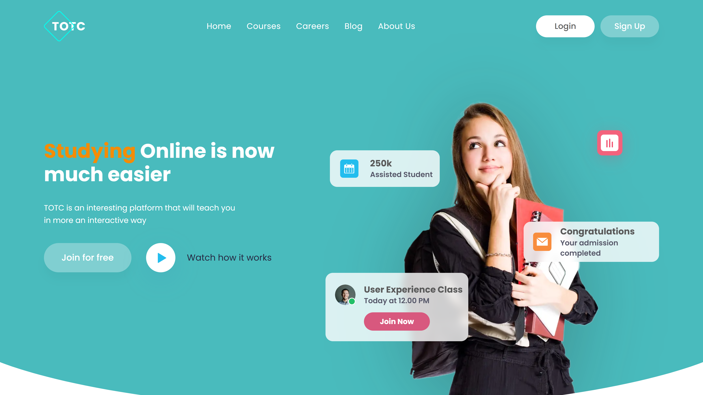
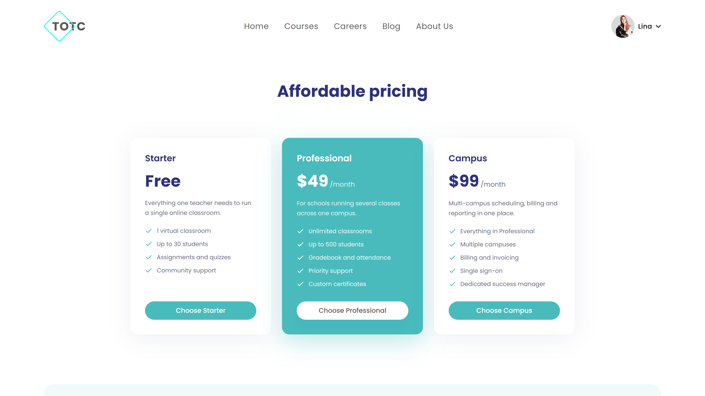
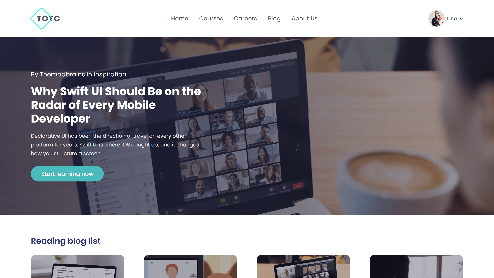
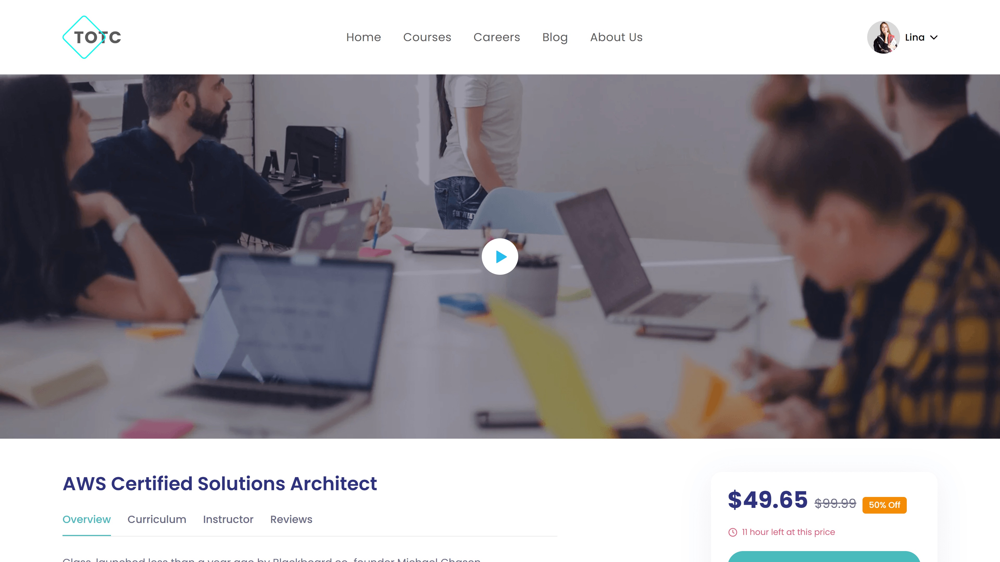
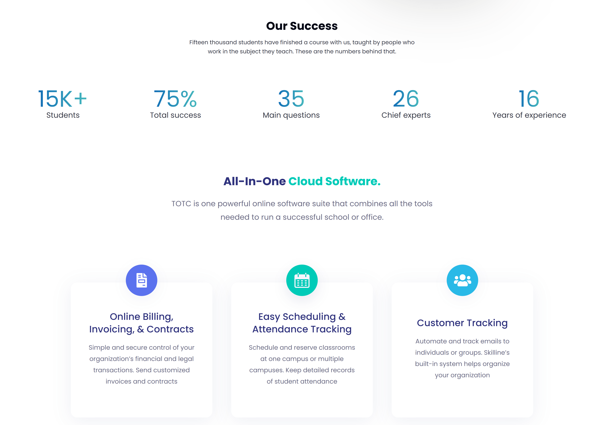
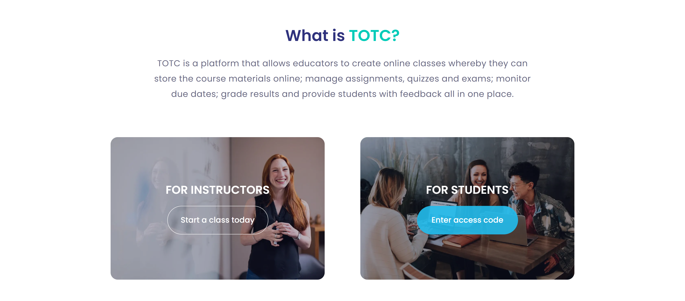
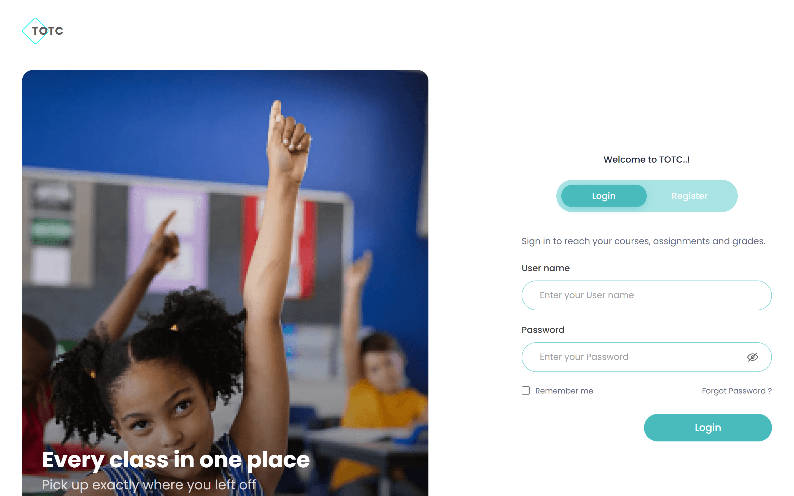
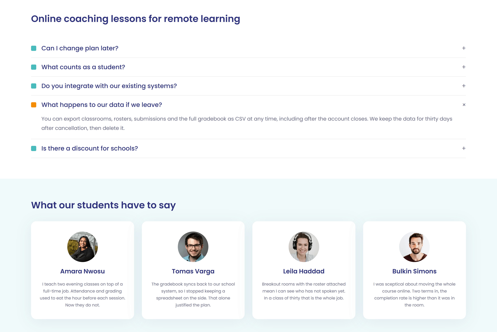
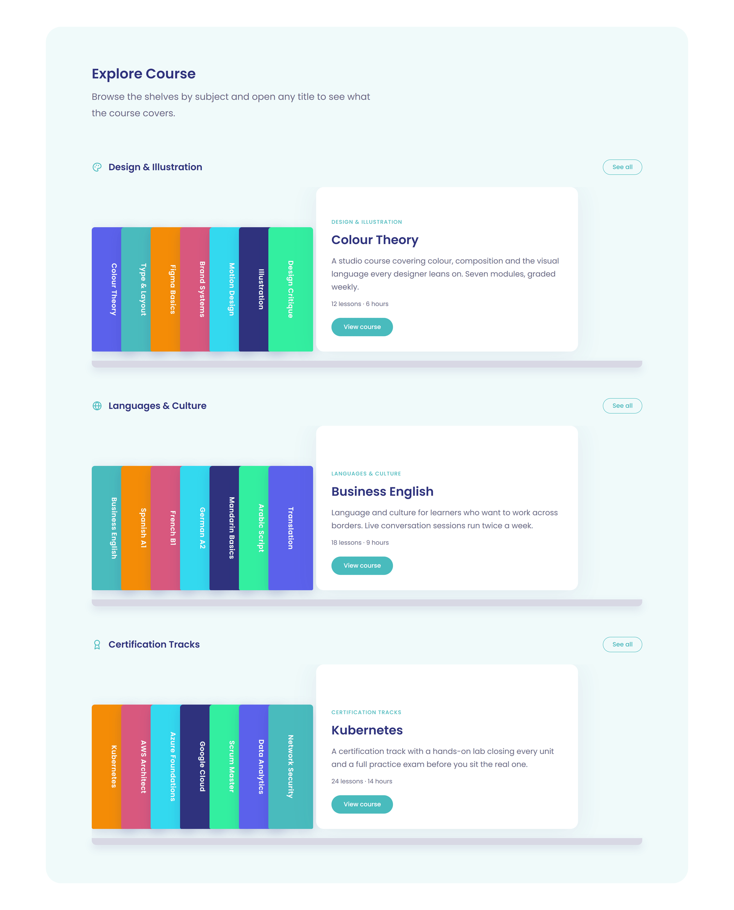
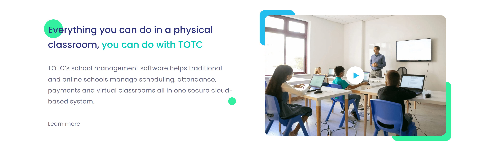

# TOTC — E-Learning Site

A Next.js implementation of the TOTC / Skilline e-learning design from Figma:
a marketing landing page, a course catalogue with detail pages, a membership
and pricing page, a blog with article pages, and login and register screens.

**Live site:** https://totc-elearning.vercel.app



> The design is not mine. It is the [E-Learning Site (Community)](https://www.figma.com/design/lElMe5N8yxWj4cqdLcssJO/E-Learning-Site--Community-)
> file, published to the Figma Community by its author. What is being shown here
> is the implementation: the components, the responsive behaviour, the content
> layer and the copy. TOTC is not a real company, and every figure on the page
> is invented.

## Stack

| Concern | Choice |
| --- | --- |
| Framework | Next.js 16, App Router, React 19 |
| Language | TypeScript, strict |
| Styling | Tailwind CSS v4 with tokens in `src/app/globals.css` |
| Forms | react-hook-form with Zod schemas |

No animation or carousel library. The shelves and card rows scroll natively
with CSS scroll snapping, which keeps the dependency list to four packages.

## Running it

```bash
npm install
npm run dev      # http://localhost:3000
npm run build    # production build, also type-checks
npm run lint
```

## Routes

| Route | Figma frame |
| --- | --- |
| `/` | Landing, node 10:358 |
| `/login` | Login 28:131, Mobile Login 28:62 |
| `/register` | Register 28:172, Mobile Register 28:97 |
| `/courses` | Course, node 47:247 |
| `/courses/[slug]` | Course Detail, node 46:217 |
| `/membership` | MemberShip page, node 42:319 |
| `/blog` | Blog page, node 34:89 |
| `/blog/[slug]` | Blog detail, node 30:64 |
| `/privacy`, `/terms` | No frame; the footer links to both |

## Layout

```
src/
  app/                    routes; (auth) and (legal) are route groups
  components/
    layout/               SiteHeader, SiteFooter, Logo, NewsletterForm
    sections/             one file per landing-page section
    ui/                   Button, Container, cards, CurveDivider, fields
    icons/                vector data exported from Figma
    auth/                 AuthShell, tabs, login and register forms
  lib/
    content.tsx           all copy and list data
    validation.ts         Zod schemas
    nav.ts, cn.ts
```

Sections are presentational. Every string lives in `src/lib/content.tsx`, so
copy changes never touch a component.

## Design notes

- **The curve.** The teal band in the frame ends at y=990 of 1118 and bows to
  1118 at the centre. `CurveDivider` reproduces that path and is reused wherever
  a coloured band meets the page.
- **Hero composition.** At `lg` and up the hero visual is a single 911x892
  container-query canvas. The floating cards are sized in `em` against a
  container-relative font size, so the whole composition scales as one unit
  instead of drifting apart at intermediate widths. Below `lg` the same card
  components are stacked at a readable fixed size.
- **Responsive.** The Figma file is desktop-only apart from two mobile auth
  frames, so tablet and mobile layouts were designed to the same visual system.
  Content sits in a 1680px band with 120px gutters, matching the frame.

## Auth

There is no user store. This is a portfolio demo, so the server actions in
`src/app/(auth)/actions.ts` validate shape with Zod, pause briefly to make the
pending state visible, and set an `httpOnly` cookie standing in for a session.

To see the error state, log in with the username `blocked`, or register with
the email `taken@totc.dev`. Any other credentials succeed and redirect to
`/courses`.

## Deliberate deviations from the frame

1. **Nav targets.** The header keeps the five labels from the design. "Careers"
   and "About Us" have no frame of their own, so they point at the sections
   carrying that content: the teacher and instructor application panels on the
   membership page, and "What Is TOTC" on the landing page.
2. **Auth logo.** The auth frames have no logo. One was added top-left so those
   screens are not a navigational dead end.
3. **Legal pages.** `/privacy` and `/terms` are stubs, added because the footer
   in the design links to both.
4. **Spelling corrected.** The frame reads "Lastest News and Resources",
   "Rememebr me", "View hisotry", "Top Raiting", "Student are viewing" and
   "Choice favourite course from top category", and calls one role a
   "Coursector". These were reproduced at first, on fidelity grounds. They are
   corrected now: a reader who has not seen the Figma file has no way to tell a
   faithful reproduction from a careless one, and reads every instance as a
   mistake in the build.
5. **Auth copy written out.** The login and register frames are typeset in
   Lorem Ipsum throughout: the greeting, the caption over the photo panel and
   the paragraph above the fields. Real copy sits in `authCopy` instead.
   Placeholder Latin on a working sign-in screen reads as an unfinished build,
   not as fidelity to the design.
6. **Continue-learning row varied.** The frame repeats one course card three
   times. The row draws three different courses, instructors and lesson counts
   so it does not look like a data bug.
7. **Card imagery varied.** The same reasoning applied to the exports. The
   frame reuses one photo across all four course cards, and again across both
   membership panels. Each slot draws a different photo from the file instead.

## Screenshots

Captured from a production build with headless Chrome at 1920px on a 2x device
pixel ratio, and at 430px for the mobile shot.

| | |
| --- | --- |
|  |  |
|  |  |
|  |  |
|  |  |
|  |  |

The five alternating feature rows, each pairing a product illustration with its
copy:


## Figma exports

All 32 exports have landed. `docs/ASSET-EXPORTS.md` records which node each
image came from, and the generator below reports any that go missing.

```bash
node scripts/make-placeholders.mjs --list   # reports what is missing, if anything
node scripts/make-placeholders.mjs          # regenerates stand-ins for gaps
```

Four of them needed judgement rather than a straight export:

- **Podium view.** The node's bounding box runs 1122px tall because one stray
  decorative element sits far below the illustration, leaving 58% of the frame
  empty. The export is cropped to the illustration itself.
- **Auth panels.** The login and register frames bake their Lorem Ipsum caption
  into the photo. The exports are cropped above that band so the caption in
  `authCopy` is the only text on the panel.
- **Card imagery.** The frame reuses one photo across all four course cards and
  again across both membership panels. Each slot gets a different photo from the
  same file instead, for the reason given under the deviations above.
- **Illustration ratios.** `featureRows[].ratio` now matches each export
  exactly, so `object-contain` never letterboxes.

## License

MIT — see [LICENSE](./LICENSE). The licence covers this implementation, not the
Figma design it reproduces.

---

Built by **Irakli Tabukashvili**. Available for landing page and front-end work on [Upwork](https://upwork.com/freelancers/~01f246e13cb8549517).
